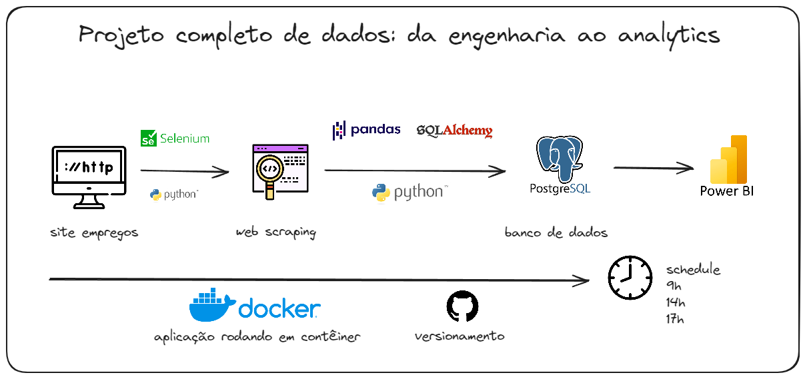

# Projeto Completo de Dados: da Engenharia ao Analytics

Esse projeto surgiu com dois propósito: 

Primeiro, que seja um projeto útil e de geração de valor para usuários reais.
A ideia foi contruir uma aplicação que possa ser utilizada por qualquer pessoa.

O segundo propósito deste projeto era desenvolver uma solução completa da área de dados, desde da extração de dados NoSQL, limpeza e tratamento, até a definição de schema, salvamento no banco, e como cereja do bolo: nosso painél de análise de tudo que construímos. 

Neste painel, além do design minimalista, usando a figma, o desenvolvi para facilita a busca por vagas de emprego na cidade de jaraguá do sul e região. É possível acessar informações da vaga com poucos cliques, e até se canditar a ela, tudo via Power BI.

E para deixar tudo ainda mais completo, os dados atualizam três vezes ao dia, garantindo assim a informação real e atulizada de cada vaga de emprego.

**Para rodar este projeto o código em sua máquina**

Execute os comandos abaixo:

1. Crie um ambiente virtual: `python3.12 -m venv .venv` ou `python -m venv .venv`
2. Ativando ambiente virtual: `.venv\Scripts\Activate.ps1` (PowerShell) ou `.venv\Scripts\Activate.bat` (Bath padrão do OS)
3. Instalar bibliotecas: `pip install -r requirements.txt`
4. Você precisa criar um arquivo .env para armazenar as variáveis de ambiente de seu banco, o nome dela deve ser: URL_DATABASE_POSTGRES
5. Para rodar um arquivo python no ambiente virtual, no mesmo prompt aberto, você deve executar python main.py
6. Caso você não queira trabalhar com schedule, basta retirar os códigos de agendamento e invocar diretamente o método start() da classe.
7. Para Sair do ambiente virtual: `deactivate`

